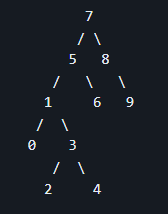

## Proje 3
[7, 5, 1, 8, 3, 6, 0, 9, 4, 2] dizisinin Binary-Search-Tree aşamalarını yazınız.

Örnek: root x'dir. root'un sağından y bulunur. Solunda z bulunur vb.

# Proje 3 Çözümü
Binary Search Tree (BST), her düğümde sol alt ağacın tüm değerlerinin düğüm değerinden küçük, sağ alt ağacın tüm değerlerinin ise düğüm değerinden büyük olduğu bir ağaç yapısıdır.
Verilen dizi: [7, 5, 1, 8, 3, 6, 0, 9, 4, 2]

Bu diziye göre Binary Search Tree (BST) oluşturulması aşağıdaki gibi olacaktır:

1. İlk eleman 7'yi root olarak alırız.
2. İkinci eleman 5, root'tan küçük olduğu için sol çocuk olur.
3. Üçüncü eleman 1, 5'ten küçük olduğu için 5'in sol çocuğu olur.
4. Dördüncü eleman 8, root'tan büyük olduğu için sağ çocuk olur.
5. Beşinci eleman 3, 1'den büyük ama 5'ten küçük olduğu için 1'in sağ çocuğu olur.
6. Altıncı eleman 6, 5'ten büyük ama 7'den küçük olduğu için 5'in sağ 1. çocuğu olur.
7. Yedinci eleman 0, 1'den küçük olduğu için 1'in sol çocuğu olur.
8. Sekizinci eleman 9, root'tan ve 8'den büyük olduğu için 8'in sağ çocuğu olur.
9. Dokuzuncu eleman 4, 3'ten büyük ama 5'ten küçük olduğu için 3'ün sağ çocuğu olur.
10. Onuncu eleman 2, 1'den büyük ama 3'ten küçük olduğu için 3'ün sol çocuğu olur.

